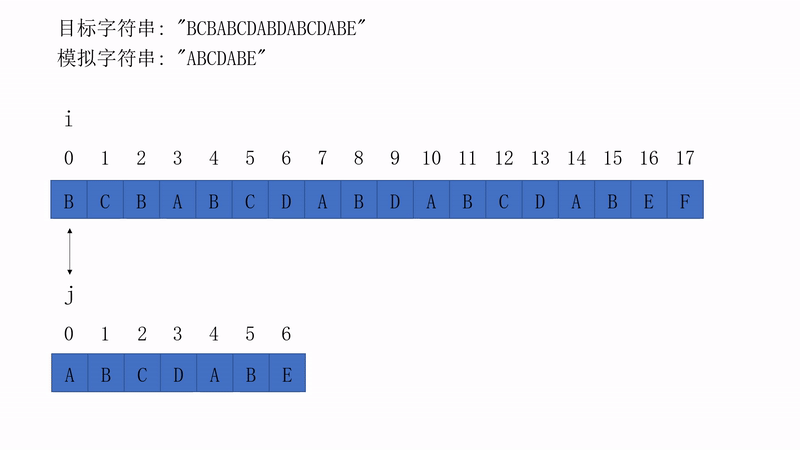
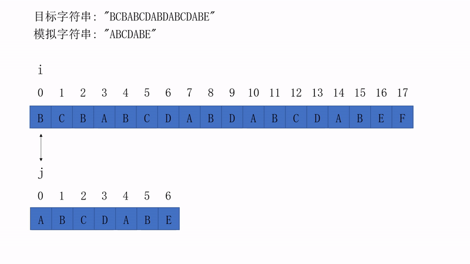
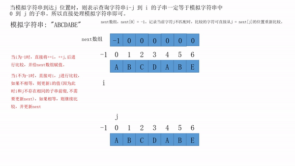

# kmp算法介绍
## 来源
KMP算法是一种改进的字符串匹配算法，由D.E.Knuth，J.H.Morris和V.R.Pratt提出的，因此人们称它为克努特—莫里斯—普拉特操作（简称KMP算法）。KMP算法的核心是利用匹配失败后的信息，尽量减少模式串与主串的匹配次数以达到快速匹配的目的。具体实现就是通过一个next()函数实现，函数本身包含了模式串的局部匹配信息。KMP算法的时间复杂度O(m+n)
> 引用自[百度百科kmp算法](https://baike.baidu.com/item/kmp%E7%AE%97%E6%B3%95/10951804?fr=aladdin)

## 理解
存在两个字符串，我们分别将其称为目标字符串str和模拟字符串m，字符串匹配算法即在目标字符串中匹配模拟字符串。

### 一般方法
1. 从目标字符串str的下标i = 0位置与模拟字符串m的下标j = 0位置开始进行比较。
2. 如果两者相同str[i] == m[j]，则i++, j++在进行比较；如果不相等str[i] != m[j],则回溯 i = i - j + 1, j = 0;
3. 重复上述步骤，直到(j == m.length() || i == m.length() 返回 -1 (未找到) ) || 找到匹配的子串返回i - j的下标位置。

以下为一般匹配方法的简单流程图：



以下为视频版本

<video src="./一般方法匹配子串.mp4" controls="controls" width="500" height="300">您的浏览器不支持播放该视频！</video>

#### 代码
一般方法不提供代码，具体可参考String 中的indexOf()方法，稍微与一般方法的代码有些不同，不过原理相似。

### kmp算法

1. 优势: 一般方法中每次不等于后，i = i - j + 1。即回到最开始比较的位置后+1，存在大量重复的比较。而一般方法i不进行回溯，通过移动j的位置进行回溯比较判断。减少了大量的重复比较，提高运行效率。

2. 实现基础：当目标字符串i到i + n与模拟字符串中j到j + n相同时，而目标字符串 i + n + 1 与 模拟字符串j + n + 1 不相等时，我们一定知道i 到 i + n为模拟字符0到n的子串。 则我们可以通过一定的算法计算出模拟字符串每个位置在未被匹配时，下一个需跳转比较位置的下标处。从而出现了next[]数组。

3. 核心原理：next[]数组的产生即为两个相同的模拟字符串中，判断模拟字符串从0开始中是否与子串中从j(j>=1)开始是否存在相同的前缀子串。减去重复子串的比较，如果不存在重复子串，则可直接进行后续的比较。而不需要通过i - j + 1进行回溯重新比较。

以下为kmp算法的简单流程图：



以下为视频版本

<video src="./kmp算法匹配字符串.mp4" controls="controls" width="500" height="300">您的浏览器不支持播放该视频！</video>

以下为next数组生成方法的简单流程图：



以下为视频版本

<video src="./next数组生成方法.mp4" controls="controls" width="500" height="300">您的浏览器不支持播放该视频！</video>

#### 代码
```
	后续上传代码

```


