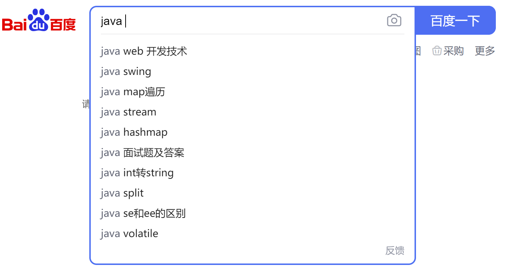
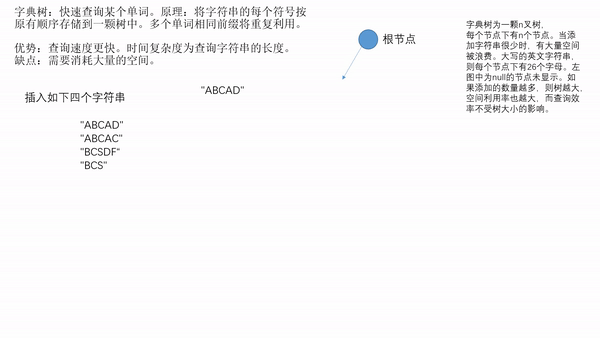

# 字典树

又称单词查找树，Trie树，是一种树形结构，是一种哈希树的变种。典型应用是用于统计，排序和保存大量的字符串（但不仅限于字符串），所以经常被搜索引擎系统用于文本词频统计。它的优点是：利用字符串的公共前缀来减少查询时间，最大限度地减少无谓的字符串比较，查询效率比哈希树高。

>https://baike.baidu.com/item/%E5%AD%97%E5%85%B8%E6%A0%91/9825209?fr=aladdin

## 应用场景



以及数据量特别大，需要快速查询的字符串类型时，字典树是一个不错的选择。

## 演示



以下为视频版本： 视频为gif的mp4.
可以 [点击此处](./字典树.mp4) 查看并下载

<video src="./字典树.mp4" controls="controls" width="500" height="300">您的浏览器不支持播放该视频！</video>

## 代码

```

	public class Trie {

	    public static void main(String[] args) {
	        Trie trie = new Trie();
	        String[] words = new String[] {
	                "ABCADDQFWCZX", "DQDWSDCDQWD", "DDQSSDASCFWEFAZ", "QWQODNANZAD",
	                "ADSQDQWEFDF", "ACBCDSUSDBZ", "ABCSIQWENJDFS", "DAQEWFVDFW",
	                "QEWDASDZC", "DQWDASAOIU", "PJFKNDUBF", "DQOIFSDNSIN",
	                "CDCDSFS", "DASQDBAI", "DQASDOZUO", "PONNIJNGF"
	        };
	        for (String word : words) {
	            trie.insert(word);
	        }
	        for (String word : words) {
	            System.out.println(trie.find(word));
	        }
	        System.out.println(trie.find("ADSFSVNSIDDQEQF"));
	    }
	
	    // 节点树
	    private static final int N = 26;
	    //  每个下面的子节点
	    Trie[] next;
	    // 当前节点是否为结束节点
	    boolean isEnd;
	
	    public Trie() {
	        next = new Trie[N];
	        isEnd = false;
	    }
	
	    // 插入字符串
	    public void insert(String word) {
	        char[] wordChars = word.toCharArray();
	        Trie current = this;
	        for (char wordChar : wordChars) {
	            Trie next = current.next[wordChar - 'A'];
	            if (next == null) {
	                current.next[wordChar - 'A'] = new Trie();
	            }
	            current = current.next[wordChar - 'A'];
	        }
	        current.isEnd = true;
	    }
	
	    // 查询某个字符串是否存在
	    public boolean find(String word) {
	        char[] wordChars = word.toCharArray();
	        Trie current = this;
	        for (char wordChar : wordChars) {
	            current = current.next[wordChar - 'A'];
	            if (current == null) {
	                return false;
	            }
	        }
	        return true;
	    }
	
	}
	

```