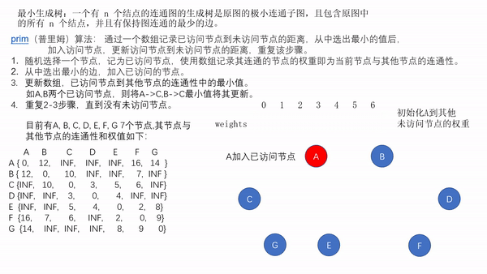
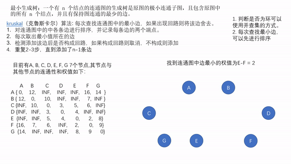

# 最小生成树

生成树： 对连通图进行遍历，过程中所经过的边和顶点的组合可看做是一棵普通树，通常称为生成树。

> http://c.biancheng.net/view/3406.html

最小生成树：一个有 n 个结点的连通图的生成树是原图的极小连通子图，且包含原图中的所有 n 个结点，并且有保持图连通的最少的边。 最小生成树可以用kruskal（克鲁斯卡尔）算法或prim（普里姆）算法求出。

> https://baike.baidu.com/item/%E6%9C%80%E5%B0%8F%E7%94%9F%E6%88%90%E6%A0%91/5223845?fr=aladdin

## 应用

要在n个城市之间铺设光缆，主要目标是要使这 n 个城市的任意两个之间都可以通信，但铺设光缆的费用很高，且各个城市之间铺设光缆的费用不同，因此另一个目标是要使铺设光缆的总费用最低。这就需要找到带权的最小生成树。

## 生成算法

1. prim算法

原理：通过一个数组记录已访问节点到未访问节点的距离，从中选出最小的值后，加入访问节点，更新访问节点到未访问节点的距离，重复该步骤。

步骤

a. 随机选择一个节点，记为已访问节点，使用数组记录其连通的节点的权重即为当前节点与其他节点的连通性。

b· 从中选出最小的边，加入已访问的节点。

c. 更新数组，已访问节点到其他节点的连通性中的最小值。如A,B两个已访问节点，则将A->C,B->C最小值将其更新。

d. 重复b-c步骤，直到没有未访问节点。

演示图。



以下为视频版本： 视频为gif的mp4.
可以 [点击此处](./最小生成树-prim.mp4) 查看并下载

<video src="./最小生成树-prim.mp4" controls="controls" width="500" height="300">您的浏览器不支持播放该视频！</video>


代码  // 以下只是一个例子，具体应用仍需根据实际情况修改

```

	public class Prim {
	
	    public static final int INF = Integer.MAX_VALUE;
	
	    public static void main(String[] args) {
	        int [][] weights = new int[][] {
	                { 0,    12,    INF,    INF,   INF,   16,   14  },
	                { 12,    0,      10,    INF,   INF,     7,  INF },
	                {INF,   10,      0,      3,       5,      6,   INF},
	                {INF,   INF,    3,       0,       4,   INF,  INF},
	                {INF,   INF,    5,       4,       0,      2,    8},
	                {16,     7,       6,     INF,     2,       0,    9},
	                {14,    INF,  INF,    INF,     8,      9,     0}
	        };
	        Prim prim = new Prim(weights, 7);
	        prim.print(prim.getTreeEdges(0));
	    }
	
	
	    int[][] weights;
	
	    int n;
	
	    public Prim(int[][] weights, int n) {
	        this.n = n;
	        this.weights = weights;
	    }
	
	    public Edge[] getTreeEdges(int startNode) {
	        Edge[] weight = new Edge[n];
	        Edge[] result = new Edge[n];
	
	        // 初始化数据
	        for (int i = 0; i < n; i++) {
	            Edge edge = new Edge(startNode, i, this.weights[startNode][i]);
	            weight[i] = edge;
	        }
	        weight[startNode].weight = 0;
	
	        for (int i = 0; i < n; i++) {
	            if (i == startNode) {
	                continue;
	            }
	            int start = 0;
	            int end = 0;
	            int min = INF;
	            // 找到最小值
	            for (int j = 0; j < n; j++) {
	                if (weight[j].weight != 0 && weight[j].weight < min) {
	                    min = weight[j].weight;
	                    start = weight[j].start;
	                    end = j;
	                }
	            }
	            result[i] = new Edge(start, end, min);
	            weight[end].weight = 0;
	            // 更新weight 保证以访问节点到未访问节点都取到最小值
	            for (int j = 0; j < n; j++) {
	                if (weight[j].weight != 0 && this.weights[end][j] < weight[j].weight) {
	                    Edge newEdge = new Edge(end, j, this.weights[end][j]);
	                    weight[j] = newEdge;
	                }
	            }
	        }
	        return result;
	    }
	
	    public void print(Edge[] edges) {
	        System.out.println("最小生成树中生成的树的边为：");
	        int min = 0;
	        for (Edge edge : edges) {
	            if (edge == null) {
	                continue;
	            }
	            min += edge.weight;
	            System.out.println("(" + edge.start + "," + edge.end + ") : " + edge.weight);
	        }
	        System.out.println("最小生成树的权重为：" + min);
	    }
	
	}
	
	class Edge {
	
	    int start;
	
	    int end;
	
	    int weight;
	
	    public Edge() {
	
	    }
	
	    public Edge (int start, int end, int weight) {
	        this.start = start;
	        this.end = end;
	        this.weight = weight;
	    }
	}

```


2. kruskal算法

原理：每次查找连通图中的最小边，如果出现回路则将该边舍去。对连通图中的中各条边进行排序，并记录每条边的两个端点。

步骤
1. 对连通图中的中各条边进行排序，并记录每条边的两个端点。
2. 每次取出最小值所在的边
3. 检测添加该边后是否构成回路，如果构成回路则取消，不构成则添加
4. 重复2-3步，直到添加了n-1条边


演示图。



以下为视频版本： 视频为gif的mp4.
可以 [点击此处](./最小生成树-kruskal.mp4) 查看并下载

<video src="./最小生成树-kruskal.mp4" controls="controls" width="500" height="300">您的浏览器不支持播放该视频！</video>

代码

```

后续补充

```


